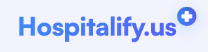
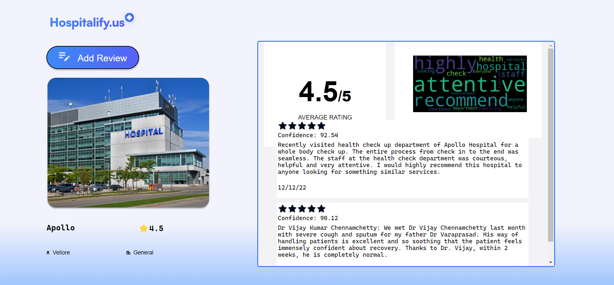
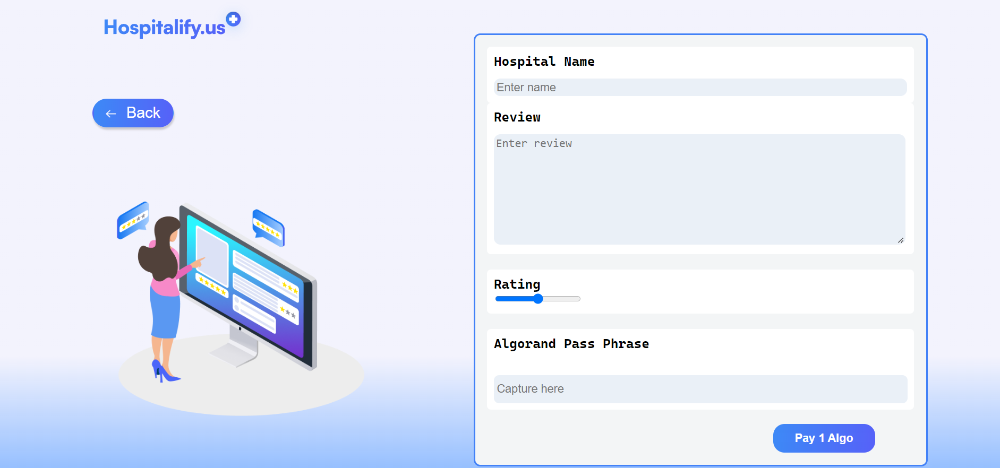
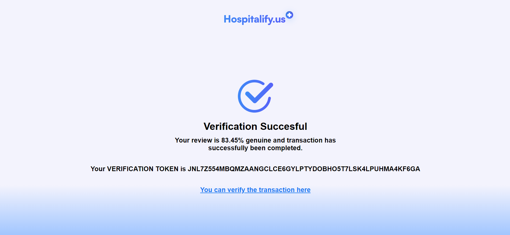

<!-- Improved compatibility of back to top link: See: https://github.com/othneildrew/Best-README-Template/pull/73 -->
<a name="readme-top"></a>
<!--
*** Thanks for checking out the Best-README-Template. If you have a suggestion
*** that would make this better, please fork the repo and create a pull request
*** or simply open an issue with the tag "enhancement".
*** Don't forget to give the project a star!
*** Thanks again! Now go create something AMAZING! :D
-->


<!-- PROJECT SHIELDS -->
<!--
*** I'm using markdown "reference style" links for readability.
*** Reference links are enclosed in brackets [ ] instead of parentheses ( ).
*** See the bottom of this document for the declaration of the reference variables
*** for contributors-url, forks-url, etc. This is an optional, concise syntax you may use.
*** https://www.markdownguide.org/basic-syntax/#reference-style-links
-->
<!-- [![Contributors][contributors-shield]][contributors-url] -->
[![MIT License][license-shield]][license-url]


<!-- PROJECT LOGO -->
<br />
<div align="center">
  <a href="https://github.com/CaptAlpha/SDHRS">
    
  </a>

  <h3 align="center">Hospitalify.US</h3>

  <p align="center">
    Now, you decide where the right treatment for you is!
    <br />
    <a href="https://github.com/CaptAlpha/SDHRS"><strong>Explore the docs »</strong></a>
    <br />
    <br />
    <a href="https://github.com/CaptAlpha/SDHRS">View Demo</a>
    ·
    <a href="https://github.com/CaptAlpha/SDHRS/issues">Report Bug</a>
    ·
    <a href="https://github.com/CaptAlpha/SDHRS/issues">Request Feature</a>
  </p>
</div>


<!-- TABLE OF CONTENTS -->
<details>
  <summary>Table of Contents</summary>
  <ol>
    <li>
      <a href="#about-the-project">About The Project</a>
      <ul>
        <li><a href="#built-with">Built With</a></li>
      </ul>
    </li>
    <li>
      <a href="#getting-started">Getting Started</a>
      <ul>
        <li><a href="#prerequisites">Prerequisites</a></li>
        <li><a href="#installation">Installation</a></li>
      </ul>
    </li>
    <li><a href="#usage">Usage</a></li>
    <li><a href="#roadmap">Roadmap</a></li>
    <li><a href="#contributing">Contributing</a></li>
    <li><a href="#license">License</a></li>
    <li><a href="#contact">Contact</a></li>
    <li><a href="#acknowledgments">Acknowledgments</a></li>
  </ol>
</details>


<!-- ABOUT THE PROJECT -->
## About The Project

  


On the internet, we are able to discover evaluations and ratings of a variety of hospitals; however, this material is quite unstructured, and it is not possible to trust it because it is derived from open forum conversations. These reviews have a high propensity to be either biassed or fraudulent most of the time.

Here's why:
* Phony physicians and hospitals frequently contribute to the creation of fake reviews.
* These reviews have been produced in a fake manner.
* A lot of people accept these reviews, which leads them to believe in phoney hospitals a lot of the time.


<p align="right">(<a href="#readme-top">back to top</a>)</p>


###  Significance of the Project

* We allow users to share their experiences from the hospitals and nursing homes using blockchain on top of Algorand's Smart Contract. This allows users to anonmously send in their feedback about a particular hospital by verifying their review with the help of a smart contract transaction.

* We try to bring in a Web based platform for smooth user experience based aggregation of reviews and ratings of a particular hospital in such a manner that the user understands what experience he is going to receive.

* We try to bring in features such as advanced data analysis, data visualization from the scraped data using various graphs and models.


### Built With

This section should list any major frameworks/libraries used to bootstrap your project. Leave any add-ons/plugins for the acknowledgements section. Here are a few examples.

* [![Next][Next.js]][Next-url]
* [![React][React.js]][React-url]
* [![Vue][Vue.js]][Vue-url]
* [![Angular][Angular.io]][Angular-url]
* [![Svelte][Svelte.dev]][Svelte-url]
* [![Bootstrap][Bootstrap.com]][Bootstrap-url]
* [![JQuery][JQuery.com]][JQuery-url]
* [![JQuery][Algorand.com]][JQuery-url]

<p align="right">(<a href="#readme-top">back to top</a>)</p>

###  Our Team
Member | Role
------------- | -------------
Arhit Bose Tagore  | Team Lead (Blockchain/ML/Backend Developer)
Aviral Jain  |  ML/Backend Developer
Sanket Babar  |  Designer
Shreyash Mehrotra  |  Frontend Developer

<!-- GETTING STARTED -->
## Getting Started

Execute the following steps to run the web application on your local machine

### Prerequisites

This is an example of how to list things you need to use the software and how to install them.
* Python-3.9.x

For Linux Enviroment
  ```sh
 $ sudo apt-get install python3.9
  ```
  For Windows Enviroment

 [Download here](https://www.python.org/downloads/release/python-3910/)


### Installation

_Below are the steps to run the file

1. Get a free Algorand Wallet Credentials [Algorand Wallet Credentials](https://wallet.myalgo.com/add-account)
2. Clone the repo
   ```sh
   git clone https://github.com/CaptAlpha/SDHRS.git
   ```
3. Install the required packages
   ```sh
   pip install -r requirements.txt
   ```
4. All API Keys (for Cohere, Algorand, Purestack) are already present in the code file.

⚠️ All API Keys are exposed and only meant for testing and prototype only.

<p align="right">(<a href="#readme-top">back to top</a>)</p>


<!-- USAGE EXAMPLES -->
## Usage

Navigate through the web interface to interact with the application.

_For more examples, please refer to the [Documentation](https://example.com)_




<p align="right">(<a href="#readme-top">back to top</a>)</p>


<!-- CONTRIBUTING -->
## Contributing

Contributions are what make the open source community such an amazing place to learn, inspire, and create. Any contributions you make are **greatly appreciated**.

If you have a suggestion that would make this better, please fork the repo and create a pull request. You can also simply open an issue with the tag "enhancement".
Don't forget to give the project a star! Thanks again!

1. Fork the Project
2. Create your Feature Branch (`git checkout -b feature/AmazingFeature`)
3. Commit your Changes (`git commit -m 'Add some AmazingFeature'`)
4. Push to the Branch (`git push origin feature/AmazingFeature`)
5. Open a Pull Request

<p align="right">(<a href="#readme-top">back to top</a>)</p>


<!-- LICENSE -->
## License

Distributed under the MIT License. See `LICENSE.txt` for more information.

<p align="right">(<a href="#readme-top">back to top</a>)</p>


<!-- CONTACT -->
## Contact

Your Name - [@BoseArhit](https://twitter.com/arhit) - arhitbt@gmail.com

Project Link: [Hospitalify.US](https://github.com/CaptAlpha/SDHRS)

<p align="right">(<a href="#readme-top">back to top</a>)</p>


<!-- ACKNOWLEDGMENTS -->
## Acknowledgments

Use this space to list resources you find helpful and would like to give credit to. I've included a few of my favorites to kick things off!

* [Choose an Open Source License](https://choosealicense.com)
* [GitHub Emoji Cheat Sheet](https://www.webpagefx.com/tools/emoji-cheat-sheet)
* [Malven's Flexbox Cheatsheet](https://flexbox.malven.co/)
* [Malven's Grid Cheatsheet](https://grid.malven.co/)
* [Img Shields](https://shields.io)
* [GitHub Pages](https://pages.github.com)
* [Font Awesome](https://fontawesome.com)
* [React Icons](https://react-icons.github.io/react-icons/search)

<p align="right">(<a href="#readme-top">back to top</a>)</p>


<!-- MARKDOWN LINKS & IMAGES -->
<!-- https://www.markdownguide.org/basic-syntax/#reference-style-links -->
[contributors-shield]: https://img.shields.io/github/contributors/othneildrew/Best-README-Template.svg?style=for-the-badge
[contributors-url]: https://github.com/othneildrew/Best-README-Template/graphs/contributors
[forks-shield]: https://img.shields.io/github/forks/othneildrew/Best-README-Template.svg?style=for-the-badge
[forks-url]: https://github.com/othneildrew/Best-README-Template/network/members
[stars-shield]: https://img.shields.io/github/stars/othneildrew/Best-README-Template.svg?style=for-the-badge
[stars-url]: https://github.com/othneildrew/Best-README-Template/stargazers
[issues-shield]: https://img.shields.io/github/issues/othneildrew/Best-README-Template.svg?style=for-the-badge
[issues-url]: https://github.com/othneildrew/Best-README-Template/issues
[license-shield]: https://img.shields.io/github/license/othneildrew/Best-README-Template.svg?style=for-the-badge
[license-url]: https://github.com/othneildrew/Best-README-Template/blob/master/LICENSE.txt
[linkedin-shield]: https://img.shields.io/badge/-LinkedIn-black.svg?style=for-the-badge&logo=linkedin&colorB=555
[linkedin-url]: https://linkedin.com/in/othneildrew
[product-screenshot]: images/screenshot.png
[Next.js]: https://img.shields.io/badge/Flask-000000?style=for-the-badge&logo=flask&logoColor=white
[Next-url]: https://flask.palletsprojects.com/
[React.js]: https://img.shields.io/badge/HTML5-E34F26?style=for-the-badge&logo=html5&logoColor=white
[React-url]: https://developer.mozilla.org/en-US/docs/Web/HTML
[Vue.js]: 	https://img.shields.io/badge/CSS3-1572B6?style=for-the-badge&logo=css3&logoColor=white
[Vue-url]: https://developer.mozilla.org/en-US/docs/Web/CSS
[Angular.io]: https://img.shields.io/badge/JavaScript-323330?style=for-the-badge&logo=javascript&logoColor=F7DF1E
[Angular-url]: https://angular.io/
[Svelte.dev]: 	https://img.shields.io/badge/Python-FFD43B?style=for-the-badge&logo=python&logoColor=blue
[Svelte-url]: https://svelte.dev/
[Laravel.com]: https://img.shields.io/badge/Laravel-FF2D20?style=for-the-badge&logo=laravel&logoColor=white
[Laravel-url]: https://laravel.com
[Bootstrap.com]: https://img.shields.io/badge/Bootstrap-563D7C?style=for-the-badge&logo=bootstrap&logoColor=white
[Bootstrap-url]: https://getbootstrap.com
[JQuery.com]: https://img.shields.io/badge/jQuery-0769AD?style=for-the-badge&logo=jquery&logoColor=white
[Algorand.com]: https://img.shields.io/badge/Algorand-v2-brightgreen
[JQuery-url]: https://jquery.com 